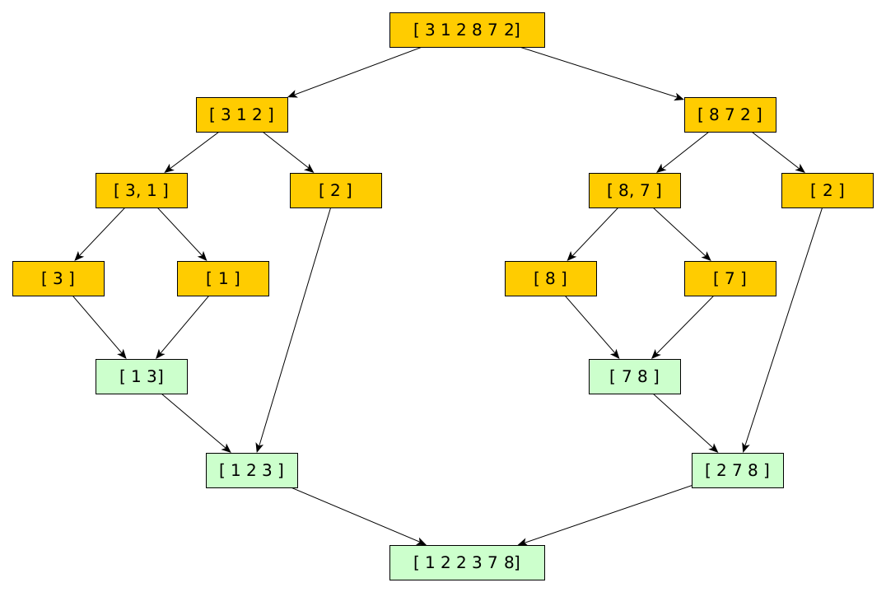

# Tris

## Critères d'analyse des algorithmes de tri

* Complexité en temps
* Complexité en mémoire
* Stabilité


<div class="alert alert-warning" role="alert"><b>Définition: </b><br>
    Un algorithme de tri est dit <b>stable</b> si deux objets avec des clés identiques apparaissent dans le même ordre dans la sortie triée et dans l'entrée à trier.
</div>

Dans les exemples ci-dessous, expliquer si l'algorithme de tri utilisé peut-être qualifié de stable. Quelle est la clé de tri utilisée ?

*Exemple 1 :* 

Entrée à trier : 


Sortie triée : 


*Exemple 2:* 

Entrée à trier : Pomme, Citron, Orange, Poire

Sortie triée : Citron, Orange, Poire, Pomme

Animation pour tester la stabilté de différents tris : http://lwh.free.fr/pages/algo/tri/stabilite_tri.html

## Tris internes par comparaison

Nous allons étudier trois algorithmes de tri parmi les plus efficaces lorsqu'aucune hypothèse particulière n'est faite sur la nature ou la structure des clés des éléments à trier : 
* le tri rapide ou tri par segmentation $O(n^2)$ mais avec une complexité en moyenne de $n\log(n)$
* le tri fusion $O(n\log(n))$
* le tri par tas $O(n\log(n))$

Remarque : On parle de tri interne en opposition aux tris externes quand les objets à trier sont placés dans la mémoire de l'ordinateur sur lequel s'effectue le tri. En pratique, cette hypothèse n'est pas toujours réalisable. Dans ce cas le tri exécute des opérations de lecture et d'écriture sur le support de stockage.

### Définitions :

* Dans un tri par comparaison, on s’autorise uniquement cinq tests sur les données à l’entrée : $=,\ <,\ >,\ \leqslant,\ \geqslant$.
* La complexité temporelle des algorithmes peut être calculée en nombre de comparaisons effectuées.


## Les tris naïfs

Ce sont des algorithmes n'utilisant aucun paradigmes ni aucune structures de données élaborées.

* Tri sélection
* Tri insertion
* Tri bulles

$$\begin{array}{|l|c|c|c|}\hline
\text{Tris} & \text{Complexité temps} & \text{Complexité mémoire} & \text{Stabilité}\\\hline
\text{Sélection} & \Theta(n^2)& \Theta(1)& non\\\hline
\text{Insertion} & \Omega(n)\ /\ O(n^2)& \Theta(1)& oui\\\hline
\text{À bulles} & \Theta(n^2)& \Theta(1)& oui\\\hline
\end{array}$$

**Questions :**

1. Rappelez brievement le principe de ces tris en présentant pour chacun les étapes pour trier le tableau suivant :
$\begin{array}{|c|c|c|c|}\hline
3 & 2 & 8 & 1 & 7\\\hline
\end{array}$
1. Expliquer pourquoi la complexité en temps du tri insertion est différente des deux autres tris.
1. À partir d'un exemple, expliquer pourquoi le tri sélection n'est pas un tri stable.

Simulateur : https://visualgo.net/en/sorting

De nombreux tris nécessitent d'échanger la position de deux éléments à partir de leur clé respective. Écrire une fonction Python permettant d'effectuer cet échange.


```python
def echanger(tab, i, j):
    """
    i, j --> int : Les indices des éléments dont la position doit être échangée
    """
```

## Diviser pour régner

On présente maintenant deux algorithmes de tri basés sur le paradigme diviser pour régner 

### Tri rapide (Quick sort)
Le tri rapide d'un tableau $T$ comprend deux phases : 
* La première phase transforme le tableau $T$ en un tableau $T' = [G,p,D]$ avec : 
    * $p$ un élément de $T$ appelé **pivot**
    * $G$ la partie gauche du tableau $T'$ dont toutes les valeurs sont inférieures à la valeur de $p$
    * $D$ la partie droite du tableau $T'$ dont toutes les valeurs sont supérieures à la valeur de $p$
* La seconde phase consiste simplement en deux appels récursifs de l'algorithme, l'un pour le tableau $G$ et l'autre pour le tableau $D$. Un appel récursif de l'algorithme de **tri rapide** est terminal pour $n = 1$ avec $n$ le nombre d'éléments dans le tableau à traiter.


```python
def triRapide(T, i, j):
    
    if i < j:   
        pivot = pivoter(T, i, j) # p
        triRapide(T, i, pivot-1)   # G
        triRapide(T, pivot+1, j) # D
```

#### Comment construire $T'$ ?

L'efficacité du tri rapide dépend directement de l'algorithme qui permet de construire à partir de la tableau $T$ le tableau $T'$. Ce dernier doit déterminer le pivot $p$ et réorganiser le tableau $T$ pour obtenir $T'$.

Le choix du pivot n'est pas anodin, pour s'en convaincre on pourra lire la doc Python : https://github.com/python/cpython/blob/main/Objects/listsort.txt

Pour simplifier les choses nous choisirons systématiquement le premier élément du tableau comme pivot, c'est à dire $T[i]$. L'algorithme consiste ensuite à déplacer tous les éléments de $T[i+1, j]$ inférieurs à $p$ sur la partie gauche du tableau $T$ en effectuant des échanges. 


```python
def pivoter(T, i, j):
    
    p = i
    pivot = T[i]
    g, d = i+1, j+1
    for k in range(g, d):
        if T[k] <= pivot:
            p += 1
            echanger(T, p, k)
    echanger(T, i, p)
    return p
```

**Questions :** 
1. Détailler l'exécution de la fonction ```pivoter``` pour le tableau suivant :
$\begin{array}{|c|c|c|c|c|c|}\hline
3 & 1 & 2 & 7 & 8 & 2\\\hline
\end{array}$
1. Tracer l'arbre des appels de la fonction ```triRapide``` pour ce même tableau avec les couples $(i, j)$ comme sommets.
1. Tracer l'arbre des appels de la fonction ```triRapide``` pour un tableau trié comportant 6 éléments.

#### Complexité

La complexité de la fonction ```pivoter``` sur un tableau de taille $n$ est $\Theta(n)$. En effet, l'indice $k$ (qui au départ vaut $i+1$) est incrémenté jusqu'à ce que $k = j$, la position du pivot est mise à jour si $T[k] \leqslant \text{pivot}$ pour déplacer les éléments inférieurs au pivot à gauche de celui-ci. 

Regardons à présent le tri. La fonction ```triRapide``` contient deux appels récursifs, le premier traite la partie gauche $G$ du tableau $T'$ et le second la partie droite $D$ du tableau $T'$ qui ont respectivement un coût $C(p)$ et $C(n-p)$. D'autre part, nous venons de voir que la fonction ```pivoter``` avait un coût $\Theta(n)$. L'expression récurrente de la complexité du tri rapide est donc :

$$C(n) = C(p) + C(n-p) + \Theta(n)$$

* Si $p = 1$ (tableau trié), c'est à dire le cas ou la fonction ```pivoter``` sépare le tableau en deux parties complètement déséquilibrées, l'un des sous tableau ne contient qu'un unique élément, la relation de récurrence devient : 

$$\begin{array}{lr}C(n) = C(1) + C(n-1) + \Theta(n) &\text{avec}\quad C(1)=\Theta(1)\\
C(n) = C(n-1) + \Theta(n) &\\
\end{array}$$

et la solution est donnée par : 

$$C(n) = \Theta(n^2)$$

<div class="alert alert-block alert-info"><b>Propriété 1:</b><br> La complexité dans le cas le plus défavorable de l'algorithme du tri rapide pour trier un tableau de taille $n$ est $C(n)=\Theta(n^2)$.</div>

On peut également raisonner à partir de l'arbre des appels qui est un arbre en peigne avec $n$ sommets. Le nombre de comparaisons est $n$ pour le niveau $0$, $n-1$ pour le niveau 1, $n-i$ pour le niveau $i$ et $0$ pour le dernier niveau soit en tout $C(n) = \dfrac{n(n+1)}{2} - 1 = \Theta(n^2)$ comparaisons. 
* Si $p = \left\lfloor\dfrac{n}{2}\right\rfloor$, la solution est donnée par le **Master Theorem** (https://fr.wikipedia.org/wiki/Master_theorem)
$$C(n) = O(n\log(n))$$

<div class="alert alert-block alert-info"><b>Propriété 2: </b><br>
La complexité en moyenne de l'algorithme du tri rapide pour trier un tableau de taille $n$ est $C(n)=O(n\log(n))$.
</div>

### Tri fusion (Merge sort)

Le tri fusion d'un tableau $T$ comprend deux phases :

* La première phase consiste en deux appels récursifs de l'algorithme pour diviser le tableau $T$ de taille $n$ en deux sous tableaux, l'un de taille $\left\lfloor\dfrac{n}{2}\right\rfloor$ et l'autre de taille $\left\lfloor\dfrac{n+1}{2}\right\rfloor$. L' appel récursif de l'algorithme de **tri fusion** est terminal pour $n = 1$. On obtient alors des sous tableaux qui ne contiennent plus qu'une unique valeur et donc trié...
* La seconde phase consiste à fusionner les sous tableaux triés.


```python
def triFusion(T, g, n):
    """
    T --> array : tableau à trier
    g --> int   : index de départ
    n --> int   : taille du tableau
    """
    
    if n < 2:
        return
    else:
        m = n//2
        triFusion(T, g, m)
        triFusion(T, g + m, n - m)
        fusion(T, g, n)
```


```python
def fusion (T, g, n):
    tmp = [None for i in range(n)]
    i1 = g
    i2 = g + n//2
    k = 0
    while i1 < g + n//2 and i2 < g + n:
        if T[i1] < T[i2]:
            tmp[k] = T[i1]
            i1 += 1
        else:
            tmp[k] = T[i2] 
            i2 += 1
        k += 1
    while (i1 < g + n//2):
        tmp[k] = T[i1]
        i1 += 1
        k += 1
    while (i2 < g + n):
        tmp[k] = T[i2]
        i2 += 1
        k += 1
    
    for i in range(n):
        T[g+i] = tmp[i]
```

**Questions :** 
1. Détailler l'exécution de l'appel suivant : ```fusion([1,2,3,2,7,8], 0, 6)```

1. Compléter si nécessaire et indiquez l'ordre des appels de la fonction ```triFusion``` dans l'arbre suivant




#### Complexité

La complexité de la fonction ```fusion``` sur un tableau de taille $n$ est $\Theta(n)$. 

La fonction ```triFusion``` contient deux appels récursifs, le premier traite la partie gauche $G$ du tableau $T'$  de taille $\left\lfloor\dfrac{n}{2}\right\rfloor$ et le second la partie droite $D$ du tableau $T'$ de taille $\left\lfloor\dfrac{n+1}{2}\right\rfloor$. Quand $n$ est suffisament grand le coût de chaque appel est en $C(\frac{n}{2})$ D'autre part, nous venons de voir que la fonction ```fusion``` avait un coût $\Theta(n)$. L'expression récurrente de la complexité du tri rapide est donc :

$$C(n) = 2C(\frac{n}{2})+ \Theta(n)$$

<div class="alert alert-block alert-info"><b>Propriété 3: </b><br>
La complexité de l'algorithme du tri fusion pour trier un tableau de taille $n$ est $C(n)=\Theta(n\log(n))$.
</div>

## Structure de données

### Tri par tas

#### Notion de tas

<div class="alert alert-warning" role="alert"><b>Définition: </b><br>
    Un <b>tas</b> est un arbre binaire quasi parfait dont les sommets contiennent les éléments d'un ensemble $\mathbb{E}$ muni d'une clé $c : \mathbb{E} \rightarrow \mathbb{F}$ où $\mathbb{F}$ est totalement ordonné. 
</div>

<div class="alert alert-warning" role="alert"><b>Définition: </b><br>
    Un <b>arbre binaire quasi parfait</b> est un arbre binaire dont toutes les feuilles sont situées sur deux niveaux au plus. L'avant dernier niveau est complet et les feuilles du dernier niveau sont regroupées le plus à gauche possible. 
</div>

Les arbres binaires parfaits sont intéressants car ils peuvent être simplement et naturellement stockés sous forme de tableaux : 
* L'index $1$ est affecté à la racine
* Pour chaque noeud d'index $i$ on affecte le fils : 
    * gauche à l'index $2i$
    * droit à l'index $2i + 1$
On peut ainsi affecter un entier positif unique à chaque noeud.

**Remarque:** La première case du tableau d'index $0$ est **vide**


\begin{array}{|c|c|c|c|c|c|c|c|c|c|c|}\hline
 \phantom{0}& 1 & 3 & 2 & 5 & 6 & 4 & 10 & 8 & 7 & 9\\\hline
\end{array}

**Question:** Écrire les fonctions Python **pere(i), filsDroit(i)** et **filsGauche(i)** qui renvoie les indices des noeuds correspondants sans la case vide au début du tableau


```python
def pere(i):
    return (i-1)//2

def filsDroit(i):
    return 2*i + 2

def filsGauche(i):
    return 2*i + 1
```


```python
t = [1, 3, 2, 5, 6, 4, 10, 8, 7, 9]
print(f"Pere du noeud 9 : {t[pere(9)]}")
print(f"Fils droit du noeud 3 : {t[filsDroit(1)]}")
print(f"Fils gauche du noeud 2 : {t[filsGauche(2)]}")
```

Les **complexités en temps et en espace** sont en $\Theta(1)$ 

### Construction d’un tas à partir d’un tableau.

<div class="alert alert-warning" role="alert"><b>Définition: </b><br>
    Un tas est un tableau d’entiers tel que pour tous les indices <b>i</b> strictement positifs, la valeur de <b>T[i]</b> est inférieure ou égale à celle de <b>T[pere(i)]</b>
</div> 

Le but de cette partie est d’effectuer la transformation représentée par les tableaux ci-dessous:

\begin{array}{|c|c|c|c|c|c|c|c|}\hline
 5 & 2 & 6 & 0 & 1 & 9 & 1 & 5 \\\hline
\end{array} en  \begin{array}{|c|c|c|c|c|c|c|c|}\hline
 9 & 5 & 6 & 2 & 1 & 5 & 1 & 0 \\\hline
\end{array} 

**Question :** Écrire une fonction **estUnTas(t, n)** qui retourne **True** si le tableau T est un tas, **False** sinon.


```python
def estUnTas(t, n):
    for i in range(1, n):
        if t[i] > t[pere(i)]:
            return False
    return True
```


```python
t = [5, 2, 6, 0, 1, 9, 1, 5]
print(estUnTas(t, len(t)))
t = [9, 5, 6, 2, 1, 5, 1, 0]
print(estUnTas(t, len(t)))
```

La complexité en temps est en $O(n)$ avec n = longueur(T), et celle en espace est en $\Theta(1)$.

**Question:** Écrire une fonction **maximum(T, i, limite)** qui retourne l'indice (inférieur à limite) de la plus grande des trois valeurs **T[i], T[filsGauche(i)]** et **T[filsDroit(i)]**. En cas de valeurs égales, le plus petit indice est retourné. Par exemple sur le tableau précédent maximum(T, 0, 8) = 2, maximum(T, 2, 8) = 5, maximum(T, 3, 8) = 7 et maximum(T, 3, 7) = 3.


```python
def maximum(t, i, limite):
    imax = i
    g, d = filsGauche(i), filsDroit(i)
    if g < limite and t[g] > imax:
        imax = g
    if d < limite and t[d] > imax:
        imax = d
    return imax
```


```python
print(f"maximum(t, 0, 8) = {maximum(t, 0, 8)}")
print(f"maximum(t, 2, 8) = {maximum(t, 2, 8)}")
print(f"maximum(t, 3, 8) = {maximum(t, 3, 8)}")
print(f"maximum(t, 3, 7) = {maximum(t, 3, 7)}")
```

**Question:** Avec la fonction récursive suivante, dessiner l'arbre des appels après l’appel **entasserRecursif(T, 0, 8)**


```python
def entasserRecursif(t, i, limite):
    imax = maximum(t, i, limite)
    if imax != i:
        echanger(t, i, imax)
        entasserRecursif(t, imax, limite)
        
def echanger(t, i, j):
    t[i], t[j] = t[j], t[i]
```


```python
t = [5, 5, 9, 2, 1, 6, 1, 0]
entasser(t, 0, 8)
print(t)
```

**Question** La fonction **entasserRecursif(T, i, limite)** est récursive terminale. Ecrire une fonction itérative **entasser(T, i, limite)**  ́equivalente.


```python
def entasser(t, i, limite):
    imax = maximum(t, i, limite)
    while imax != i:
        echanger(t, i, imax)
        i = imax
        imax = maximum(t, i, limite)
```

L’algorithme **entasser(T, i, limite)**  ́echange des valeurs du tableau de haut en bas, en suivant une branche de l’arborescence. Cela a pour effet de faire descendre des petites valeurs, et de faire monter les grandes valeurs. Il est donc possible de construire un tas, en itérant cet algorithme sur les indices décroissants du tableau.


```python
def construireTas(t, n):
    for i in range((n-1)//2, -1, -1):
        entasser(t, i, n)
```


```python
t = [5, 2, 6, 0, 1, 9, 1, 5]
print(estUnTas(t, len(t)))
construireTas(t, len(t))
print(estUnTas(t, len(t)))
```

Si l’on utilise l’algorithme itératif pour entasser, les complexités sont :
* en temps en $\Omega(n)$ si T est déjà un tas, $O(nlog_2(n))$ avec n = longueur(T),
* en espace en $\Theta(1)$.

## Trier avec un tas

Dans un tas, la valeur maximale est à la racine de l’arborescence, donc en $T[0]$. Dans le tableau trié, cette valeur doit être en **T[len(T)-1]**. Il suffit donc d’echanger ces deux valeurs pour progresser vers la solution. Une fois cette  ́echange fait, si l’on exclut la dernière valeur du tableau, le tas est peu changé. En fait **entasser(T,0,len(T)-1)** va créer un nouveau tas pour les valeurs du tableau dont les indices sont inf ́erieurs à **limite = len(T)-1**. Il suffit donc d’itérer ces deux  ́etapes:
* echanger,
* entasser 

pour trier un tas.

**Question:** Écrire une fonction **trierParTas(t, n)** qui transforme un tableau en tas puis en un tableau trié par ordre croissant.


```python
def trierTas(t, n):
    construireTas(t, n)
    for i in range(n-1, 0, -1):
        echanger(t, 0, i)
        entasser(t, 0, i)
```


```python
t = [5, 2, 6, 0, 1, 9, 1, 5]
trierTas(t, len(t))
print(t)
```

Si l’on utilise l’algorithme itératif pour entasser, les complexités sont :
* en temps en $\Omega(n)$ si toutes les valeurs de T sont égales, $O(n\log_2(n))$ avec n = longueur(T),
* en espace en $\Theta(1)$

#### Inserer un élément dans un tas
Pour **l'insertion** d'une clé $x$ : 
* Créer une feuille contenant cet élément à coté de la feuille la plus à droite du niveau le plus bas
* La définition du tas est ensuite restaurée en faisant remonter l'élément dans l'arbre tant que la relation d'ordre n'est respectée de la manière suivante
    * Comparer le contenu de l'élément à celui de son père
    * Effectuer un échange qui respecte la relation d'ordre du tas

Par exemple la clé $75$ serait insérée de la manière suivante dans le tas


#### Supprimer un élément dans un tas

La suppression de la plus petite / grande clé (suivant la relation d'ordre établie au départ) dans un tas est relativement simple également.
* Remplacer le contenu de la racine par le contenu $x$ de la feuille la plus à droite du niveau le plus bas
* Supprimer cette feuille
* La définition du tas est ensuite restaurée en faisant descendre le contenu $x$ de la nouvelle racine dans l'arbre tant que la relation d'ordre n'est respectée de la manière suivante
    * Comparer $x$ avec le contenu des fils 
    * Effectuer un échange qui respecte la relation d'ordre du tas.


<div class="alert alert-block alert-info"><b>Propriété 4: </b><br>
La hauteur d'un tas est logarithmique en fonction du nombre de ses sommets, donc l'insertion ou la suppression sont des algorithmes de complexité temporelle logarithmique, sous réserve que les opérations élémentaires s'implémentent en temps constant.
</div>

**Remarque :** Pour la suppression, la recherche d'un élément quelconque dans un tas à une complexité temporelle $O(n)$ où $n$ est le nombre d'éléments dans le tas. En effet, la racine d'un sous-arbre d'un tas ne donne aucune indication concernant le sous-arbre dans lequel se trouve l'élément recherché.
